艾尔登法环环境配置

1. 存档相关说明
游戏启动位置:ELDEN RING\Game\eldenring.exe
存档位置:把76561197960267366文件夹放到下面路径。
C:\Users\用户名\AppData\Roaming\EldenRing\76561197960267366
   1.文件夹不能有中文字符,套用文件夹不能过多
   2.系统用户名不能是中文

4/4/2024 update for 存档:
1.AppData文件夹如果找不到请勾选显示隐藏文件，如图

   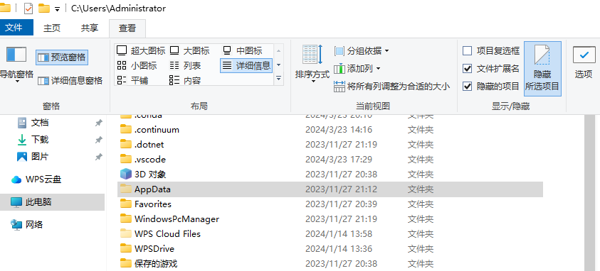

2.如果用STEAM启动游戏，请用ERSaveIDEditor.exe这个程序更换存档：

   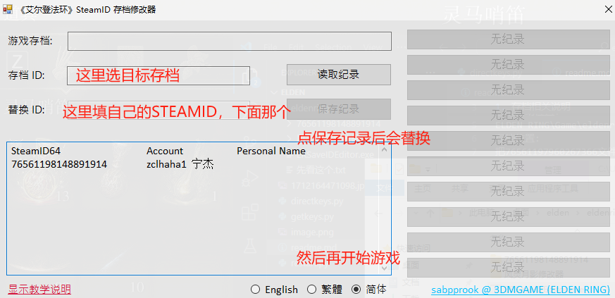

2. 人物状态说明
   能力值
   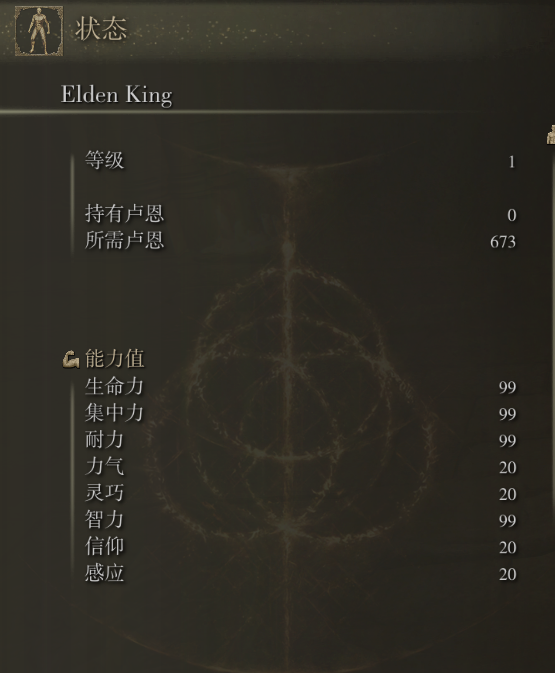

生命力对应血量
集中力对应蓝量
耐力对应绿条，可以理解为行动力，施法/移动/翻滚/攻击等一切行为皆需要耐力，耐力会自动回复，耐力空值后除了行走无法进行任何操作
力气/灵巧/信仰/感应此次训练不需要，具体与武器类型的伤害补正有关（伤害补正会在下文中解释），皆设置为20
智力对应法术强度，设置为99

   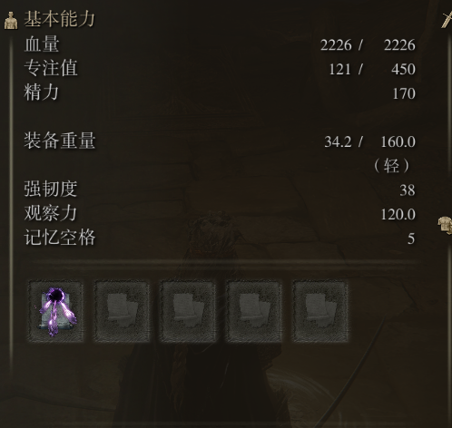

基本属性如下
HP：2226
MP：450
Energy: 170
记忆（携带法术）：陨石术

3. 武器相关知识补充：
主武器（右手武器）：名刀月隐

   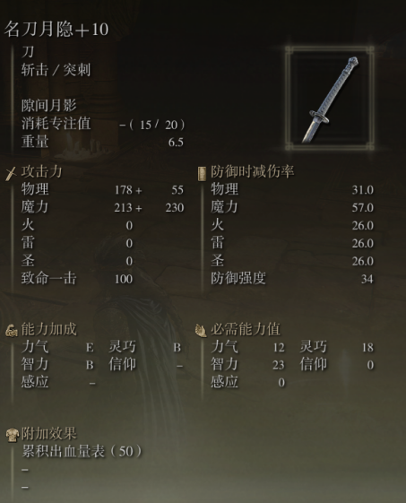

副武器（左手武器）：卡利亚权杖

   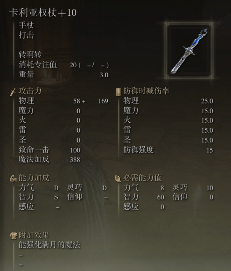

必需能力值指的是：如果相关属性加点不够阈值，则无法发挥武器全部性能，伤害会很低

能力加成指的是相关属性的伤害补正，S为最高，其次是A、B、C、D、E、F, 当能力值为S时，意味着该属性越高，这把武器伤害越高，正相关收益最高，能力值为F时，意味着能力值与该武器伤害虽然成正比关系，但收益很低，可以忽略不计

附加效果：累计出血量表50指的是，每一次有效命中可以给敌方上一层50的出血debuff，达到100时敌方会受到单次巨量出血伤害，但是每个角色（敌我）都有出血抗性，所以往往需要数刀才能累计满出血效果

攻击力指的是可以对敌方造成的伤害，但由于敌人同样具备物理抗性与魔法抗性等诸多抗性，所以不能造成面板伤害上的178+55+213+230，实际造成伤害约为329（名刀月隐轻攻击）

战技只能释放右手武器或者双手武器的战技，所以当我们携带右手武器名刀月隐，左手武器卡利亚权杖时，默认释放的是隙间月影而不是转啊转

法术需要携带法杖才能释放，所以当左手武器为空时无法释放法术，蓝量为空时同样无法释放法术

4. 其他相关配置
游戏亮度：

   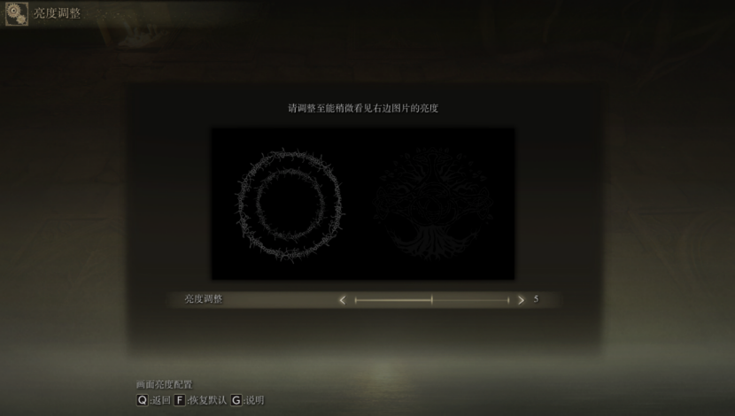
   
窗口分辨率：

   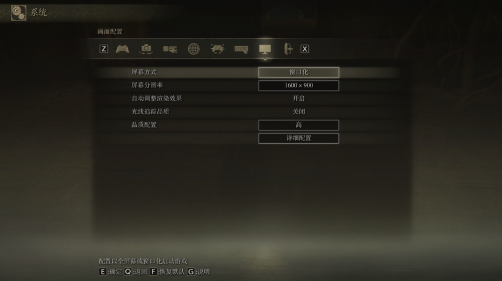
   
游戏画质：

   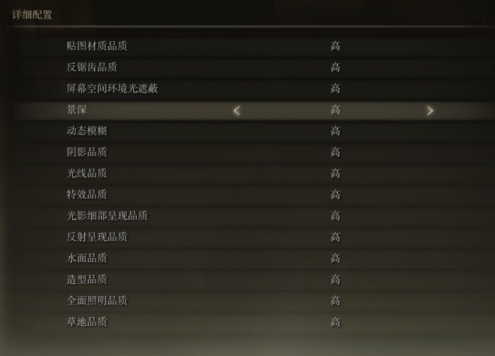

4/4/2024 update:
游戏按键：
   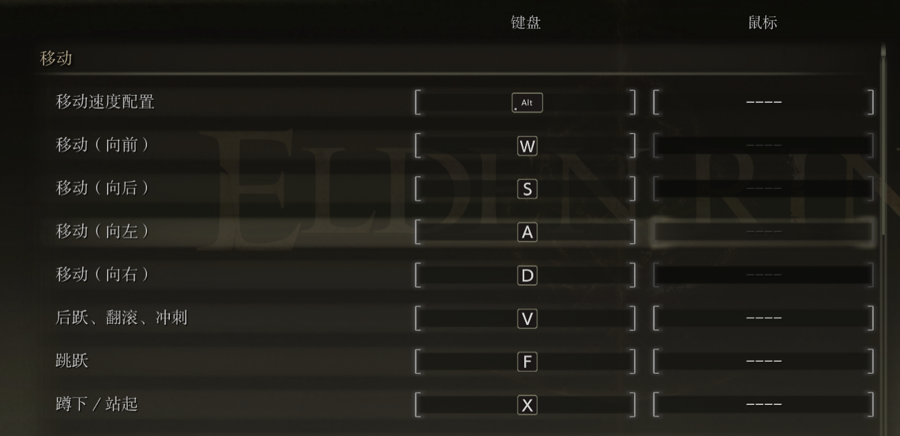

   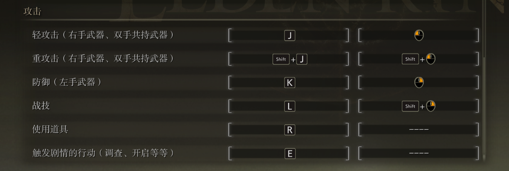
   1.记得进游戏后改成键盘、鼠标操作：
   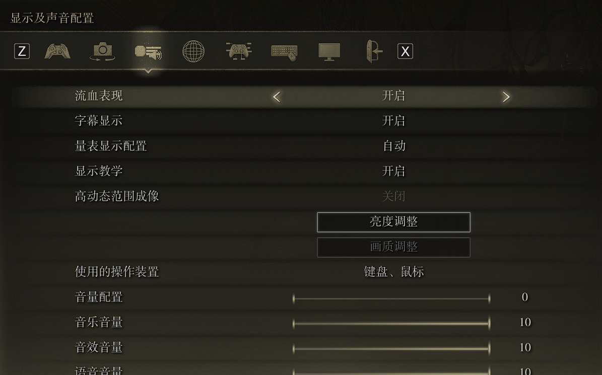
   2.还有无边框窗口化或者窗口化，不然无法键盘映射：
   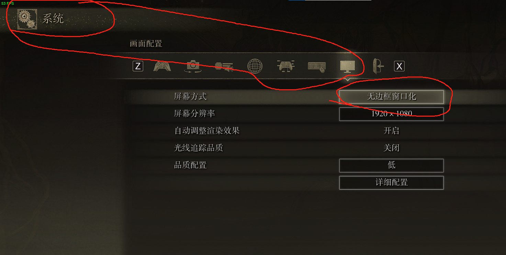
